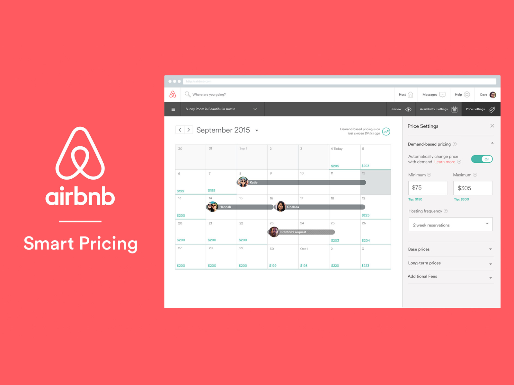

# AirBnB Kaggle | Machine learning competition:
Proyecto creado para la competición de [Kaggle](https://www.kaggle.com/c/airbnb-ironhack/overview/description)
---

## OBJETIVO
---
Predecir el precio de una serie de alojamientos pertenecientes a la plataforma AirBnB analizando las características que se facilitadas ubicadas en los Dataset base de la competición.

## CONTENIDOS
---
Al inicio de la competición se facilitaron los siguientes [archivos](https://www.kaggle.com/c/airbnb-madrid-ironhack/data):

* `Train.csv` dataset base para entrenar nuestros modelos, contiene el target de nuestras predicciones(columna precio)
* `Test.csv` dataset para poner a prueba las predicciones de nuesto modelo
* `Sample.csv` modelo de documento para poder cargar las predicciones en él antes de cargar en Kaggle las predicciones del modelo

## PROCESO 
---
* Exploracion de nuestra columna price, que es el objetivo a predecir en el test
* Limpieza y preparación del contenido del resto de columna para poder tratarlo con los modelos de predicción, las funciones de tratamiento y limpieza de columnas se pueden encontrar en `funciones.py`

## LIBRERÍAS USADAS
---
* [pandas](https://pandas.pydata.org/pandas-docs/stable/) 
* [numpy](https://numpy.org/doc/1.22/)
* [sklearn](https://www.kite.com/python/docs/sklearn)
* [h2o](https://docs.h2o.ai/h2o/latest-stable/h2o-py/docs/intro.html)
